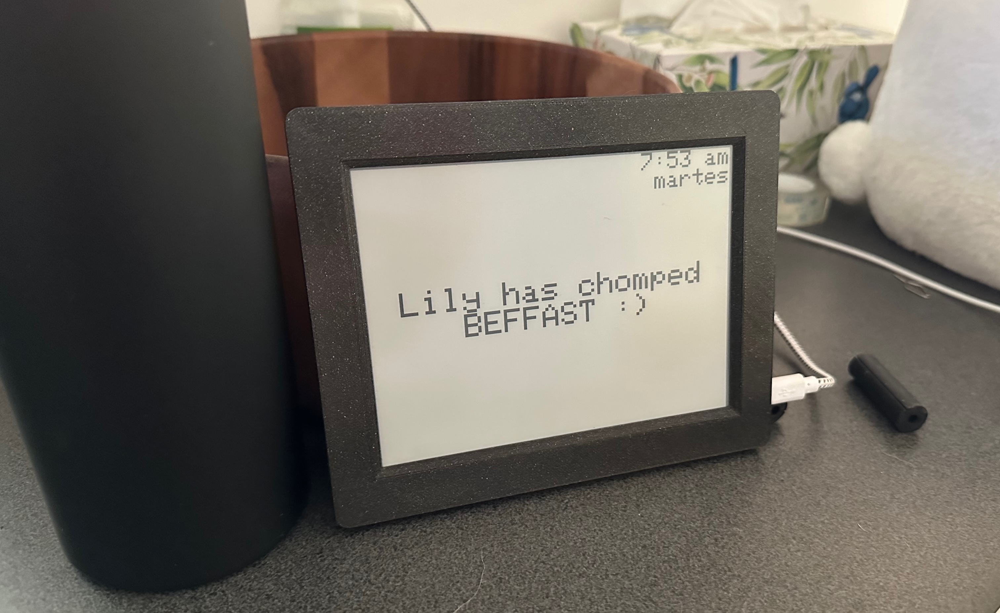

# beffast

Inkplate application which shows whether the dog's been fed or not yet.  Exposes
a HTTP server to (un)feed the dog.

The `nix build` is broken, use `nix develop -- arduino-cli compile -v -u beffast`.

